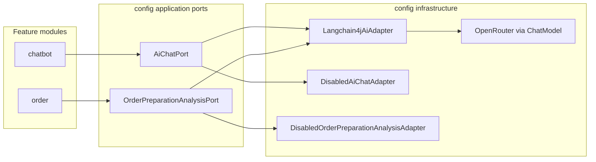

# AI Integration

---

## Summary

High-level design of how Milly talks to an LLM provider. AI is an optional outbound capability owned by the **config** module behind application ports. Domain features (table chatbot, order preparation estimates) call those ports; they never talk to OpenRouter or LangChain4j directly.

Table chatbot WebSocket wiring and message flow: [chatbot.md](./chatbot.md). System overview: [system-design.md](../system-design.md).

---

## Table of contents

1. [Design goals](#design-goals)
2. [Architecture](#architecture)
3. [Outbound ports](#outbound-ports)
4. [Adapters and enablement](#adapters-and-enablement)
5. [Consumers](#consumers)
6. [Resilience](#resilience)
7. [Configuration](#configuration)
8. [Related documentation](#related-documentation)

---

## Design goals

| Goal | Approach |
|------|----------|
| Optional AI | `milly.ai.enabled=false` by default; disabled adapters throw a clear unavailable error |
| Feature isolation | Chatbot and order modules depend on ports, not on vendor SDKs |
| Single provider wiring | LangChain4j `OpenAiChatModel` pointed at OpenRouter |
| Fail soft where needed | Circuit breaker on provider calls; some callers treat failure as optional |

---

## Architecture

When AI is enabled, `Langchain4jAiAdapter` implements both ports. When disabled (default), separate disabled adapters are active instead.

---

## Outbound ports

| Port | Method | Purpose |
|------|--------|---------|
| `AiChatPort` | `chat(menuContext, history, userMessage)` | Menu-aware conversational reply |
| `OrderPreparationAnalysisPort` | `estimatePreparationTime(orderPreparationJson)` | Structured prep-time estimate for an order |

Responses are wrapped as `AiResponse` (`rawContent` string). Parsing into domain results (e.g. minutes) happens in the calling feature module.

Prompts:

| Use case | Prompt source |
|----------|---------------|
| Table chat | `classpath:prompt/system-requirements.txt` with `{{menu}}` replaced by formatted menu context |
| Prep estimate | `classpath:prompt/order-preparation-analyzer.txt` via LangChain4j `AiServices` |

---

## Adapters and enablement

| Condition | Chat | Prep analysis |
|-----------|------|---------------|
| `milly.ai.enabled=true` + `OPENROUTER_API_KEY` set | `Langchain4jAiAdapter` | Same adapter + `OrderPreparationAnalyzer` bean |
| `milly.ai.enabled=false` or missing | `DisabledAiChatAdapter` | `DisabledOrderPreparationAnalysisAdapter` |

If AI is enabled but the API key is missing, startup fails with an explicit configuration error.

Provider stack: LangChain4j `OpenAiChatModel` → OpenRouter OpenAI-compatible HTTP API (default model `google/gemini-2.0-flash-001`).

---

## Consumers

| Consumer | Module | Port | Notes |
|----------|--------|------|-------|
| Table chatbot | `chatbot` | `AiChatPort` | Customer STOMP chat; see [chatbot.md](./chatbot.md) |
| Prep-time estimate | `order` | `OrderPreparationAnalysisPort` | Staff order endpoint; uses order + menu payload |

---

## Resilience

- Resilience4j **circuit breaker** named `ai` wraps live adapter methods.
- Fallbacks convert provider failures into `AiServiceUnavailableException`.
- Circuit breaker thresholds are configurable (`resilience4j.circuitbreaker.instances.ai.*`).

Callers decide UX: chatbot publishes an `ERROR` chat event; order prep estimate may return empty / fail the request depending on the use case path.

---

## Configuration

| Property / env | Default | Purpose |
|----------------|---------|---------|
| `milly.ai.enabled` / `AI_ENABLED` | `false` | Turn AI on |
| `milly.ai.open-router.api-key` / `OPENROUTER_API_KEY` | empty | Required when enabled |
| `milly.ai.open-router.model-name` / `AI_MODEL` | `google/gemini-2.0-flash-001` | Model id |
| `milly.ai.open-router.base-url` / `OPENROUTER_BASE_URL` | OpenRouter API v1 | Base URL |
| `milly.ai.max-tokens` / `AI_MAX_TOKENS` | `1024` | Max completion tokens |
| `milly.ai.log-requests` / `AI_LOG_REQUESTS` | `false` (`true` in dev) | Log provider requests |
| `milly.ai.log-responses` / `AI_LOG_RESPONSES` | `false` (`true` in dev) | Log provider responses |
| `OPENROUTER_HTTP_REFERER` / `OPENROUTER_APP_TITLE` | client URL / `Milly` | OpenRouter attribution headers |

---

## Related documentation

| Document | Covers |
|----------|--------|
| [chatbot.md](./chatbot.md) | Table chat STOMP destinations, AI call path, event types |
| [environment-setup.md](../environment-setup.md) | `AI_*` / OpenRouter env vars and other config |
| [installation.md](../installation.md) | Docker Compose and local run |
| [web-socket-flow.md](../web-socket-flow.md) | Connection modes and subscription/send guards |
| [system-design.md](../system-design.md) | Modules and system context |
