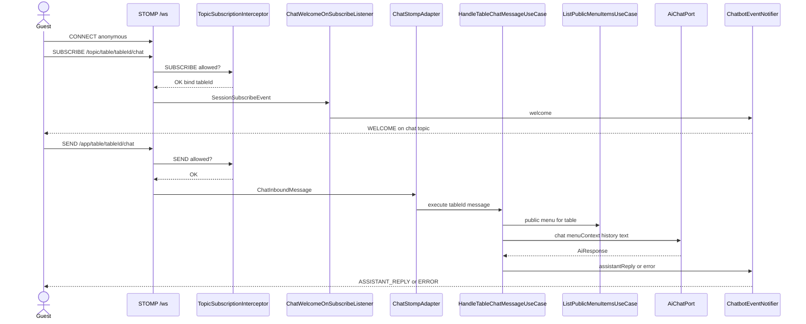

# Table Chatbot

---

## Summary

Customer table chat over **STOMP**: guests send messages on an application destination; the **chatbot** module loads menu context, calls `AiChatPort`, and publishes replies (or errors) to a table chat topic. Connection and topic guards are shared with the rest of WebSocket security. AI provider design: [ai-integration.md](./ai-integration.md). WebSocket security: [web-socket-flow.md](../web-socket-flow.md).

---

## Table of contents

1. [Destinations](#destinations)
2. [Access model](#access-model)
3. [Components](#components)
4. [End-to-end flow](#end-to-end-flow)
5. [Inbound and outbound payloads](#inbound-and-outbound-payloads)
6. [AI wiring](#ai-wiring)
7. [Failure modes](#failure-modes)

---

## Destinations

| Direction | Destination | Role |
|-----------|-------------|------|
| Client → server | `/app/table/{tableId}/chat` | Send user message (`@MessageMapping`) |
| Server → client | `/topic/table/{tableId}/chat` | Welcome, assistant reply, error events |

Helpers live in `StompTopics` (`tableChatTopic`, parse helpers for subscribe and send).

Chat is **not** persisted server-side today: the client supplies recent history on each send; the server truncates it before calling the model.

---

## Access model

Customers connect **anonymously** to `/ws` (same public handshake as other customer realtime channels).

| Action | Rule |
|--------|------|
| `SUBSCRIBE` `/topic/table/{tableId}/chat` | Allowed for anonymous sessions; first table bind wins for the session |
| `SEND` `/app/table/{tableId}/chat` | Anonymous only; destination table must match session-bound table |
| Staff JWT session | Cannot send to table chat destinations |

Subscription and send checks are enforced by `TopicSubscriptionInterceptor` (see [web-socket-flow.md](../web-socket-flow.md)).

---

## Components

| Piece | Location | Responsibility |
|-------|----------|----------------|
| `ChatStompAdapter` | chatbot inbound WS | Maps `/table/{tableId}/chat` → use case |
| `ChatWelcomeOnSubscribeListener` | chatbot inbound WS | On chat-topic subscribe → welcome event |
| `HandleTableChatMessageUseCase` | chatbot application | Menu context + AI call + notify |
| `MenuContextFormatter` | chatbot application | Formats public menu items for the prompt |
| `ChatbotEventNotifier` | chatbot application | Publishes `ChatMessageEvent` to the chat topic |
| `AiChatPort` | config port | LLM chat (live or disabled adapter) |

---

## End-to-end flow

---

## Inbound and outbound payloads

### Inbound (`ChatInboundMessage`)

| Field | Meaning |
|-------|---------|
| `text` | Current user message (blank → ignored) |
| `history` | Prior turns `{ role, content }` with `role` `user` or `assistant` |

Server keeps at most the last **10** history messages and drops unknown roles.

### Outbound (`ChatMessageEvent`)

| `type` | When |
|--------|------|
| `WELCOME` | First subscribe to the table chat topic (`"Welcome to Milly!"`) |
| `ASSISTANT_REPLY` | Model returned non-empty text |
| `ERROR` | AI disabled/unavailable, missing table, empty model reply, or unexpected failure |

---

## AI wiring

1. Resolve public menu for `tableId` (`ListPublicMenuItemsUseCase`).
2. Format menu text (`MenuContextFormatter`).
3. Call `AiChatPort.chat(menuContext, history, userMessage)`.
4. Live adapter builds: system prompt (`prompt/system-requirements.txt` + menu) + history turns + current user message → OpenRouter via LangChain4j.
5. Publish reply or map exceptions to `ERROR` events.

No REST endpoint is required for chat; the path is WebSocket only. Provider enablement, circuit breaker, and env vars are documented in [ai-integration.md](./ai-integration.md).

---

## Failure modes

| Situation | Guest sees |
|-----------|------------|
| Empty `text` | No event |
| AI disabled / circuit open / provider error | `ERROR` with unavailable / provider message |
| Unknown / unavailable table | `ERROR` `"This table is not available."` |
| Empty model content | `ERROR` retry message |
| Other runtime failure | `ERROR` generic message |
| Subscribe/send wrong table or as staff | Guard rejects (`AccessDeniedException`) |

Chat does not fall back to a scripted assistant reply when AI is off — guests get an explicit error event instead.
