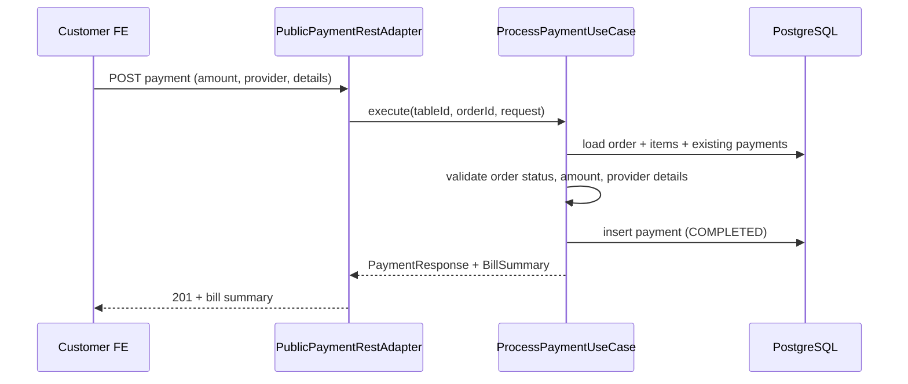

# Billing & Payment Flow

**Author:** Omar Ismayilov

---

## Summary

Describes how Milly handles **mock payments** for the customer table flow: per-order partial payments, provider abstraction, validation rules, and the billing module API. Payments are **not** real charges — the backend records payment attempts after validation.

Payment progress is independent of order lifecycle: customers pay against an **approved** order; staff still **close** the order manually when ready. For public endpoint security see [security-flow.md](./security-flow.md). For module layout see [system-design.md](./system-design.md).

---

## Table of contents

1. [Domain model](#domain-model)
2. [API endpoints](#api-endpoints)
3. [Process payment flow](#process-payment-flow)
4. [Validation rules](#validation-rules)
5. [Module structure](#module-structure)
6. [Failure modes](#failure-modes)

---

## Domain model

### Payment entity

Current scaffold (`PaymentEntity`) is extended for provider metadata:

| Field | Type | Notes |
|-------|------|-------|
| `id` | UUID | Primary key (ULID-based) |
| `orderId` | UUID | FK → `orders.id` |
| `amount` | Money | Payment amount |
| `status` | PaymentStatus | `PENDING`, `COMPLETED`, `FAILED` |
| `provider` | PaymentProvider | `CARD`, `APPLE`, `GOOGLE` |
| `paymentType` | PaymentType | `FULL`, `CUSTOM`, `SPLIT` |
| `providerReference` | String | Generated transaction reference (e.g. `pay_x7k2`) |
| `providerMetadata` | JSONB | Safe display data: `{ last4, brand, splitPeople }` |
| `failureReason` | String? | Set when status = FAILED |
| `createdAt` | OffsetDateTime | |
| `updatedAt` | OffsetDateTime | |

**Never persisted:** full card number, CVV, expiry as raw credentials, or wallet tokens.

### Value objects

```
PaymentStatus   → PENDING | COMPLETED | FAILED
PaymentProvider → CARD | APPLE | GOOGLE
PaymentType     → FULL | CUSTOM | SPLIT
```

### Bill summary (read model, not persisted)

Computed on read from order items + payments:

| Field | Derivation |
|-------|------------|
| `orderTotal` | Sum of `quantity × unitPrice` for order items |
| `paidAmount` | Sum of `COMPLETED` payment amounts for the order |
| `remaining` | `max(0, orderTotal - paidAmount)` |
| `fullyPaid` | `paidAmount >= orderTotal` |

---

## API endpoints

All billing write/read endpoints for customers live under the **public table** scope (anonymous, no JWT):

```
/api/v1/public/tables/{tableId}/orders/{orderId}/...
```

Staff can read payment progress via enriched order responses on existing staff order endpoints (see [Read endpoints](#read-endpoints)).

### Create payment

```
POST /api/v1/public/tables/{tableId}/orders/{orderId}/payments
Header: X-Idempotency-Key  (optional; safe retry when present)
```

**Request body:**

```json
{
  "amount": "42.50",
  "paymentType": "split",
  "provider": "card",
  "providerDetails": {
    "last4": "4242",
    "brand": "visa",
    "expiryMonth": 12,
    "expiryYear": 2028
  },
  "splitPeople": 4
}
```

| Field | Required | Notes |
|-------|----------|-------|
| `amount` | yes | Decimal string; must be > 0 and ≤ remaining |
| `paymentType` | yes | `full`, `custom`, or `split` |
| `provider` | yes | `card`, `apple`, or `google` |
| `providerDetails` | conditional | Required for `card` (at least `last4`, `brand`); optional/minimal for wallets |
| `splitPeople` | conditional | Required when `paymentType` is `split`; must be ≥ 2 |

**Response (201):**

```json
{
  "data": {
    "payment": {
      "id": "01932a1b-...",
      "amount": "42.50",
      "status": "COMPLETED",
      "provider": "CARD",
      "paymentType": "SPLIT",
      "providerReference": "pay_x7k2",
      "providerMetadata": {
        "last4": "4242",
        "brand": "visa",
        "splitPeople": 4
      },
      "createdAt": "2026-07-07T10:30:00Z"
    },
    "bill": {
      "orderTotal": "170.00",
      "paidAmount": "42.50",
      "remaining": "127.50",
      "fullyPaid": false
    }
  },
  "message": "Payment processed successfully."
}
```

On validation failure, return 422 — see [Failure modes](#failure-modes).

### Read endpoints

**Bill summary (billing-owned):**

```
GET /api/v1/public/tables/{tableId}/orders/{orderId}/bill
```

Returns `orderTotal`, `paidAmount`, `remaining`, `fullyPaid`, and a list of completed payments.

**Enriched order responses:**

Add `paidAmount` and `remaining` to `OrderResponse` (public) and `StaffOrderResponse` (staff) so list/detail views do not require a separate bill call. Bill endpoint remains the dedicated read for the payment screen.

---

## Process payment flow



**Concurrency:** `ProcessPaymentUseCase` runs inside a transaction. Remaining balance is recomputed inside the transaction before insert. If two devices pay simultaneously and the combined amount would exceed the total, the second request is rejected.

---

## Validation rules

### Order eligibility

| Order status | Can pay? |
|--------------|----------|
| PENDING | No |
| APPROVED | Yes |
| REJECTED | No |
| CLOSED | No |

Order must belong to the `tableId` in the URL path.

### Amount

- `amount > 0`
- `amount ≤ remaining` — **hard reject** on overpayment (422)
- No tips or overpayment allowance in v1

### Provider-specific

| Provider | Rules |
|----------|-------|
| `CARD` | `providerDetails.last4` (4 digits) and `providerDetails.brand` required |
| `APPLE` | No card details required |
| `GOOGLE` | No card details required |

### Payment type

| Type | Notes |
|------|-------|
| `FULL` | `amount` should equal remaining |
| `CUSTOM` | Validated against remaining |
| `SPLIT` | `splitPeople` stored in metadata |

Backend validates amount independently of type — the type is recorded for analytics/display, not used to compute amount server-side.

### Idempotency

`POST .../payments` is annotated with `@Idempotent`. Repeating the same request with the same `X-Idempotency-Key` and body returns the cached response. Reusing the key with a different body returns 409.

---

## Module structure

Follows the same layered layout as other bounded contexts:

```
billing/
├── domain/
│   ├── entity/
│   │   └── PaymentEntity.java
│   └── valueobject/
│       ├── PaymentStatus.java
│       ├── PaymentProvider.java
│       └── PaymentType.java
├── application/
│   ├── usecase/
│   │   ├── ProcessPaymentUseCase.java
│   │   └── GetBillUseCase.java
│   └── dto/
│       ├── CreatePaymentRequest.java
│       ├── PaymentResponse.java
│       └── BillSummaryResponse.java
└── infrastructure/
    ├── adapter/inbound/http/
    │   └── PublicPaymentRestAdapter.java
    └── adapter/outbound/persistence/
        └── PaymentJpaRepository.java
```

**Cross-module dependency:** billing reads order + order items to compute `orderTotal` and validate order status/table scope. Billing does **not** mutate order status.

---

## Failure modes

| Condition | HTTP | Error |
|-----------|------|-------|
| Order not found or wrong table | 404 | Resource not found |
| Order not APPROVED | 422 | Invalid state |
| Amount ≤ 0 | 422 | Validation error |
| Amount > remaining | 422 | Overpayment rejected |
| Missing card details for CARD provider | 422 | Validation error |
| Duplicate idempotency key, different body | 409 | Idempotency conflict |
| Concurrent overpayment race | 422 | Remaining insufficient |
