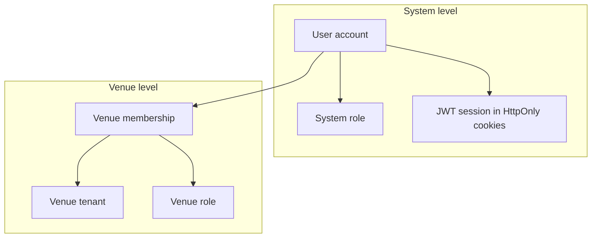
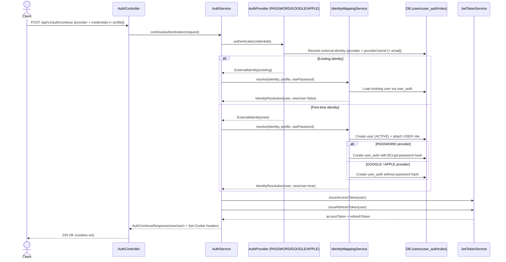
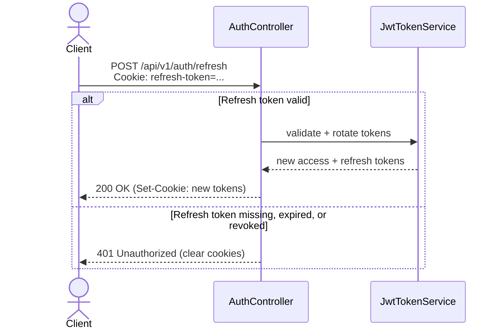
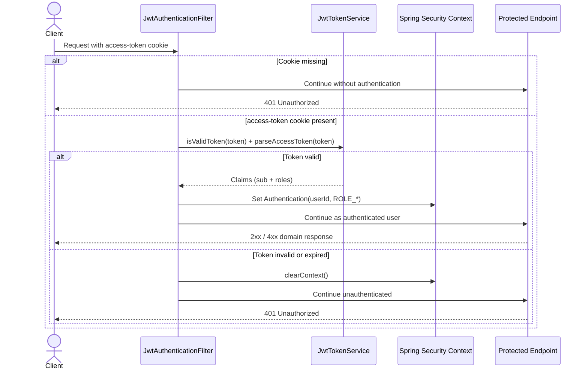
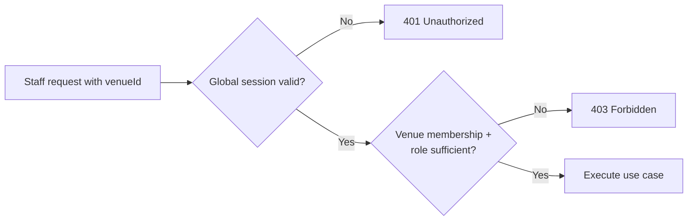
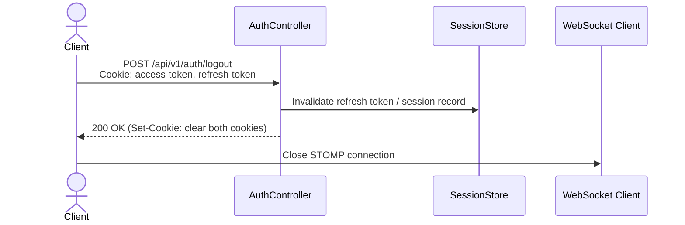

# Security Flow

**Author:** Omar Ismayilov

---

## Summary

Describes how Milly separates **system identity** from **venue access**: global authentication (sign-up, OAuth, JWT cookies), when roles are assigned, the two-step authorization rule on every staff request, session refresh and logout, and how REST security connects to WebSocket. For STOMP ticket exchange and subscription guards see [web-socket-flow.md](./web-socket-flow.md). For routes and module layout see [system-design.md](./system-design.md).

---

## Table of contents

1. [Security model overview](#security-model-overview)
2. [Roles — definitions and assignment](#roles--definitions-and-assignment)
3. [Public vs protected endpoints](#public-vs-protected-endpoints)
4. [Auth providers](#auth-providers)
5. [End-to-end auth continue flow](#end-to-end-auth-continue-flow)
6. [Cookie-based session](#cookie-based-session)
7. [Token refresh flow](#token-refresh-flow)
8. [Request authorization flow](#request-authorization-flow)
9. [Venue-scoped authorization](#venue-scoped-authorization)
10. [Logout flow](#logout-flow)
11. [WebSocket security (summary)](#websocket-security-summary)
12. [Concrete endpoint examples](#concrete-endpoint-examples)
13. [Security notes](#security-notes)
14. [Environment requirements](#environment-requirements)

---

## Security model overview

Milly uses two independent layers of identity:

| Layer | Question answered | Stored in |
|-------|-------------------|-----------|
| **System** | Who is this person? | `users`, `user_auth`, system `roles` |
| **Venue** | What can they do at *this* restaurant? | `venues`, `venue_memberships`, venue roles |

A valid global session proves system identity only. It does **not** grant access to any venue's operations. Venue access always requires a separate membership check for the `venueId` in the request.



---

## Roles — definitions and assignment

All role semantics and **when** each role is granted live here. System roles answer *who the user is globally*; venue roles answer *what they can do at a specific restaurant*.

### System roles

Stored in `users` / `roles`. Embedded in the JWT `roles` claim → Spring authorities `ROLE_<name>`.

| Role | Permissions | Assigned when |
|------|-------------|---------------|
| `USER` | Authenticated platform access (onboarding, venue join/register) | First sign-up via `POST /api/v1/auth/continue` |
| `ADMIN` | Platform administration | Admin/data operations only — never via public sign-up |

### Venue roles

Stored in `venue_memberships` — **not** in the JWT (membership changes apply immediately without re-issuing tokens). Resolved per request using `userId` + `venueId`.

| Role | Permissions | Assigned when |
|------|-------------|---------------|
| `Manager` | Orders, menu, tables, QR, invitations, venue settings, payments | User **registers a new venue**, or **redeems an invitation** with Manager role |
| `Waiter` | Orders only — view, approve, reject, close | User **redeems an invitation** with Waiter role |

A user may belong to **multiple venues** with different roles at each (e.g. Manager at Venue A, Waiter at Venue B). Sign-in methods: email/password, Google OAuth2, Apple Sign In (optional).

---

## Public vs protected endpoints

All REST endpoints are versioned under **`/api/v1`**. The WebSocket STOMP endpoint (`/ws`) is not versioned — it is a transport channel, not a REST resource surface. Future breaking API changes ship as `/api/v2`, etc., while v1 remains available during migration.

Configured behavior:

| Pattern | Access |
|---------|--------|
| `/api/v1/auth/**` | Public — sign-up, login, OAuth callback, refresh |
| `/api/v1/public/**` | Public — customer table flow (menu, orders for table, payments) |
| All other `/api/v1/**` routes | Authenticated global session required |
| Venue-scoped staff routes | Authenticated **and** sufficient venue role for the `venueId` in the path |

At the moment, the primary auth entry point is:

- `POST /api/v1/auth/continue` (public) — handles login and first-time sign-up for all supported providers.

All non-auth staff endpoints are protected by default unless explicitly whitelisted.

---

## Auth providers

`POST /api/v1/auth/continue` accepts `provider` plus provider-specific `credentials`. Unsupported providers are rejected.

| Provider | Status | Notes |
|----------|--------|-------|
| `PASSWORD` | Supported | Email + BCrypt-hashed password |
| `GOOGLE` | Supported | Google ID token validation (`GOOGLE_CLIENT_ID`) |
| `APPLE` | Optional | Apple identity token validation when configured |

---

## End-to-end auth continue flow

`POST /api/v1/auth/continue` handles both login and first-time sign-up for all supported providers. On success the response sets HttpOnly cookies; tokens are **not** returned in the JSON body.



---

## Cookie-based session

Tokens are stored in **HttpOnly, Secure (production), SameSite** cookies — not in `localStorage` and not in the `Authorization` header.

| Cookie | Purpose | Typical TTL |
|--------|---------|-------------|
| `access-token` | Sent on every authenticated REST call | Short (default 900 s) |
| `refresh-token` | Used only by `POST /api/v1/auth/refresh` | Long (default 14 days) |

Signing uses HMAC with `JWT_SECRET` (`auth.jwt.secret`).

---

## Token refresh flow

When the access token expires, the frontend calls `POST /api/v1/auth/refresh` with the `refresh-token` cookie. The browser sends cookies automatically (`credentials: 'include'`).



If refresh returns **401**, the session is ended. The frontend treats the user as logged out and clears local app state (including any open WebSocket connection).

---

## Request authorization flow

Every protected REST request passes through JWT cookie validation before reaching the controller.



Unauthorized response shape is JSON `ErrorResponse` with `status`, `error`, `message`, and `timestamp`.

Typical messages:

- Missing cookie → `No authentication details were provided.`
- Invalid/expired access token → `JWT token is expired or invalid.`

The frontend may attempt a silent refresh (see [Token refresh flow](#token-refresh-flow)) before surfacing an auth failure to the user.

---

## Venue-scoped authorization

Staff endpoints include a `venueId` (path or query). After global authentication succeeds, a second check runs:



| Step | Check | Failure |
|------|-------|---------|
| 1 | Valid global session (access-token cookie) | **401 Unauthorized** |
| 2 | User has venue membership with required role for this `venueId` | **403 Forbidden** |

Minimum venue role per action is defined in [Roles — definitions and assignment](#roles--definitions-and-assignment). The frontend may hide UI by venue role, but the **backend always enforces** permissions.

---

## Logout flow



On logout:

1. Backend invalidates the server-side session (refresh token revocation).
2. Backend clears `access-token` and `refresh-token` cookies (`Max-Age=0`).
3. Frontend closes any active WebSocket connection.

---

## WebSocket security (summary)

REST cookie auth does not carry reliably to WebSocket handshakes. Staff real-time connections use a **single-use ticket** exchanged from the authenticated session:

1. Staff calls `POST /api/v1/ws-ticket` — server reads and validates the `access-token` cookie.
2. Server returns a short-lived ticket UUID (30 s TTL, single use, stored in Caffeine).
3. Client connects: `wss://{host}/ws?ticket={uuid}`.
4. On handshake the ticket is claimed and bound to `userId`.
5. A subscription interceptor enforces venue-scoped topics at `SUBSCRIBE` time.

Customers connect **anonymously** to `/ws` and may subscribe only to `/topic/table/{tableId}`.

Full sequence diagrams, failure modes, and subscription guard rules are in [web-socket-flow.md](./web-socket-flow.md).

---

## Concrete endpoint examples

### 1) Sign-up via Continue (new user, password)

`POST /api/v1/auth/continue`

```json
{
  "provider": "PASSWORD",
  "credentials": {
    "email": "staff@example.com",
    "password": "securepassword"
  },
  "profile": {
    "firstName": "Alex",
    "lastName": "Rivera",
    "email": "staff@example.com"
  }
}
```

Typical response:

```http
HTTP/1.1 200 OK
Set-Cookie: access-token=...; HttpOnly; Secure; SameSite=Lax; Path=/
Set-Cookie: refresh-token=...; HttpOnly; Secure; SameSite=Lax; Path=/

{"newUser": true}
```

### 2) Login via Continue (existing user, password)

`POST /api/v1/auth/continue`

```json
{
  "provider": "PASSWORD",
  "credentials": {
    "email": "staff@example.com",
    "password": "securepassword"
  }
}
```

Typical response:

```http
HTTP/1.1 200 OK
Set-Cookie: access-token=...; HttpOnly; Secure; SameSite=Lax; Path=/
Set-Cookie: refresh-token=...; HttpOnly; Secure; SameSite=Lax; Path=/

{"newUser": false}
```

### 3) Sign-up / login via Google

`POST /api/v1/auth/continue`

```json
{
  "provider": "GOOGLE",
  "credentials": {
    "idToken": "<google-id-token>"
  },
  "profile": {
    "firstName": "Alex",
    "lastName": "Rivera",
    "email": "staff@example.com"
  }
}
```

`profile` is required only on first sign-up. Response shape is the same as password flow (cookies set, `newUser` flag in body).

### 4) Refresh session

`POST /api/v1/auth/refresh`

No request body. Browser sends `refresh-token` cookie automatically.

```http
HTTP/1.1 200 OK
Set-Cookie: access-token=...; HttpOnly; Secure; SameSite=Lax; Path=/
Set-Cookie: refresh-token=...; HttpOnly; Secure; SameSite=Lax; Path=/
```

### 5) Calling a venue-scoped staff endpoint

```http
GET /api/v1/venues/{venueId}/orders
Cookie: access-token=<jwt>
```

| Outcome | Response |
|---------|----------|
| No / invalid cookie | `401 Unauthorized` |
| Valid session, no membership at venue | `403 Forbidden` |
| Valid session, Waiter or Manager at venue | `200 OK` + order data |

### 6) Calling a Manager-only endpoint as Waiter

```http
POST /api/v1/venues/{venueId}/menu/items
Cookie: access-token=<jwt>
```

Waiter at this venue → `403 Forbidden`. Manager at this venue → `201 Created`.

---

## Security notes

- **Stateless JWT** with server-side refresh-token revocation on logout (`SessionCreationPolicy.STATELESS` for access validation).
- **HttpOnly cookies** protect tokens from XSS; `Secure` and `SameSite` reduce CSRF and interception risk.
- **CSRF**: cookie-based auth requires CSRF protection on mutating endpoints (e.g. double-submit cookie or SameSite=Strict where compatible).
- **Password provider** accepts `email` (or `username`) + `password` in credentials; passwords hashed with BCrypt before storage.
- **Google provider** requires a valid ID token with matching audience and verified email.
- **Apple provider** (when enabled) validates Apple identity tokens per Apple's JWKS.
- **Customer routes** (`/table/{tableId}`) remain fully public; security relies on table-scoped REST and WebSocket subscription guards (see [web-socket-flow.md](./web-socket-flow.md)).

---

## Environment requirements

| Variable | Required | Default | Purpose |
|----------|----------|---------|---------|
| `JWT_SECRET` | Yes | — | HMAC signing key (use a strong random secret, e.g. 64 chars) |
| `JWT_ACCESS_TTL_SECONDS` | No | `900` | Access token lifetime |
| `JWT_REFRESH_TTL_SECONDS` | No | `1209600` | Refresh token lifetime (14 days) |
| `GOOGLE_CLIENT_ID` | For Google auth | — | Google ID token audience validation |
| `APPLE_CLIENT_ID` | For Apple auth | — | Apple identity token validation |
