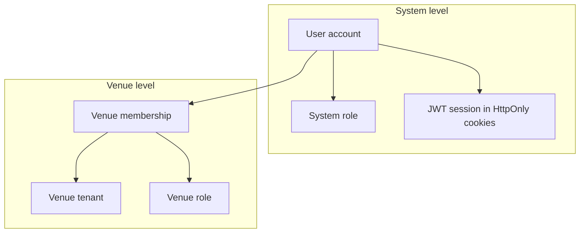
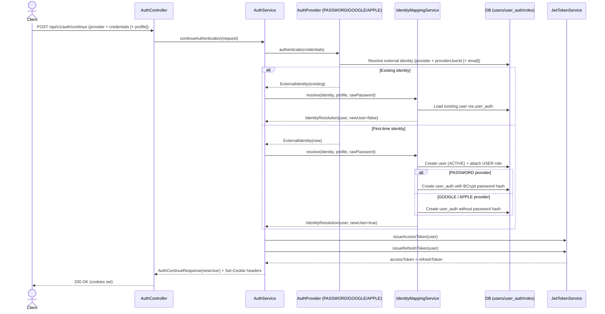

# Security Flow

**Author:** Omar Ismayilov

---

## Summary

Describes how Milly separates **system identity** from **venue access**: global authentication (sign-up, OAuth, JWT cookies), when roles are assigned, the two-step authorization rule on every staff request, session refresh and logout, and how REST security connects to WebSocket. For STOMP ticket exchange and subscription guards see [web-socket-flow.md](./web-socket-flow.md). For routes and module layout see [system-design.md](./system-design.md).

---

## Table of contents

1. [Security model overview](#security-model-overview)
2. [Roles — definitions and assignment](#roles--definitions-and-assignment)
3. [Public vs protected endpoints](#public-vs-protected-endpoints)
4. [Auth providers](#auth-providers)
5. [End-to-end auth continue flow](#end-to-end-auth-continue-flow)
6. [Cookie-based session](#cookie-based-session)
7. [Token refresh flow](#token-refresh-flow)
8. [Request authorization flow](#request-authorization-flow)
9. [Venue-scoped authorization](#venue-scoped-authorization)
10. [Logout flow](#logout-flow)
11. [WebSocket security (summary)](#websocket-security-summary)
12. [Concrete endpoint examples](#concrete-endpoint-examples)
13. [Security notes](#security-notes)
14. [Environment requirements](#environment-requirements)

---

## Security model overview

Milly uses two independent layers of identity:

| Layer | Question answered | Stored in |
|-------|-------------------|-----------|
| **System** | Who is this person? | `users`, `user_auth`, system `roles` |
| **Venue** | What can they do at *this* restaurant? | `venues`, `venue_memberships`, venue roles |

A valid global session proves system identity only. It does **not** grant access to any venue's operations. Venue access always requires a separate membership check for the `venueId` in the request.

---

## Roles — definitions and assignment

All role semantics and **when** each role is granted live here. System roles answer *who the user is globally*; venue roles answer *what they can do at a specific restaurant*.

### System roles

Stored in `users` / `roles`. Embedded in the JWT `roles` claim → Spring authorities `ROLE_<name>`.

| Role | Permissions | Assigned when |
|------|-------------|---------------|
| `USER` | Authenticated platform access (onboarding, venue join/register) | First sign-up via `POST /api/v1/auth/continue` |
| `ADMIN` | Platform administration | Admin/data operations only — never via public sign-up |

### Venue roles

Stored in `venue_memberships` — **not** in the JWT (membership changes apply immediately without re-issuing tokens). Resolved per request using `userId` + `venueId`.

| Role | Permissions | Assigned when |
|------|-------------|---------------|
| `Manager` | Orders, menu, tables, QR, invitations, venue settings, payments | User **registers a new venue**, or **redeems an invitation** with Manager role |
| `Waiter` | Orders only — view, approve, reject, close | User **redeems an invitation** with Waiter role |

A user may belong to **multiple venues** with different roles at each (e.g. Manager at Venue A, Waiter at Venue B). Sign-in methods: email/password, Google OAuth2, Apple Sign In (optional).

---

## Public vs protected endpoints

All REST endpoints are versioned under **`/api/v1`**. The WebSocket STOMP endpoint (`/ws`) is not versioned — it is a transport channel, not a REST resource surface. Future breaking API changes ship as `/api/v2`, etc., while v1 remains available during migration.

Configured behavior:

| Pattern | Access |
|---------|--------|
| `/api/v1/auth/**` | Public — sign-up, login, OAuth callback, refresh |
| `/api/v1/public/**` | Public — customer table flow (menu, orders for table, payments) |
| All other `/api/v1/**` routes | Authenticated global session required |
| Venue-scoped staff routes | Authenticated **and** sufficient venue role for the `venueId` in the path |

At the moment, the primary auth entry point is:

- `POST /api/v1/auth/continue` (public) — handles login and first-time sign-up for all supported providers.

All non-auth staff endpoints are protected by default unless explicitly whitelisted.

---

## Auth providers

`POST /api/v1/auth/continue` accepts `provider` plus provider-specific `credentials`. Unsupported providers are rejected.

| Provider | Status | Notes |
|----------|--------|-------|
| `PASSWORD` | Supported | Email + BCrypt-hashed password |
| `GOOGLE` | Supported | Google ID token validation (`GOOGLE_CLIENT_ID`) |
| `APPLE` | Optional | Apple identity token validation when configured |

---

## End-to-end auth continue flow

`POST /api/v1/auth/continue` handles both login and first-time sign-up for all supported providers. On success the response sets HttpOnly cookies; tokens are **not** returned in the JSON body.

---

## Cookie-based session
