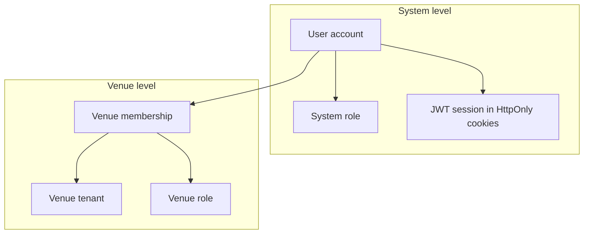

# Security Flow

---

## Summary

Milly separates **system identity** from **venue access**. A global session (JWT in HttpOnly cookies) answers who the user is. Venue operations require a separate membership and role check for the `venueId` in the request. Customers use public table-scoped APIs with no account.

Detailed topics live in this folder. For STOMP tickets and subscription guards see [web-socket-flow.md](../web-socket-flow.md). For module layout see [system-design.md](../system-design.md).

---

## Table of contents

1. [Security model overview](#security-model-overview)
2. [Roles (overview)](#roles-overview)
3. [WebSocket security (summary)](#websocket-security-summary)
4. [Related documentation](#related-documentation)

---

## Security model overview

| Layer | Question answered | Stored in |
|-------|-------------------|-----------|
| **System** | Who is this person? | `users`, `user_auth`, system `roles` |
| **Venue** | What can they do at *this* restaurant? | `venues`, `venue_memberships`, venue roles |

A valid global session proves system identity only. It does **not** grant access to any venue's operations.

Staff requests are checked in two steps:

1. **Authenticated?** — valid global session → otherwise **401**.
2. **Authorized for this venue?** — active membership with sufficient role → otherwise **403**.

The frontend may hide UI by role; the **backend always enforces** permissions.

---

## Roles (overview)

### System roles

Embedded in the JWT `roles` claim as Spring authorities `ROLE_<name>`.

| Role | Meaning |
|------|---------|
| `USER` | Default authenticated platform account |
| `ADMIN` | Platform administration (`/api/v1/admin/**`) — not granted via public sign-up |

### Venue roles

Resolved per request from `venue_memberships` (`userId` + `venueId`) — **not** stored in the JWT, so membership changes apply without re-issuing tokens.

| Role | Rank | Typical access |
|------|------|----------------|
| `OWNER` | Highest | Full venue control; assigned when registering a venue |
| `MANAGER` | Mid | Menu, tables, QR, invitations, member management, orders |
| `EMPLOYEE` | Lowest | Active-member operations (e.g. orders) |

A user may belong to multiple venues with different roles at each. Sign-in methods: password, Google, Apple (when configured).

Role assignment rules, minimum role per action, and member-management rules are in [venue-authorization-flow.md](./venue-authorization-flow.md).

---

## WebSocket security (summary)

REST cookies do not carry reliably on WebSocket handshakes.

| Client | Connection | Access rule |
|--------|------------|-------------|
| **Staff** | `POST /api/v1/ws-ticket` (authenticated) → `wss://host/ws?ticket=...` | Single-use ticket; subscribe only to allowed venue staff topics |
| **Customer** | Anonymous `wss://host/ws` | Subscribe only to table-scoped topics (including chat) |

Full ticket exchange, guards, and failure modes: [web-socket-flow.md](../web-socket-flow.md).

---

## Related documentation

| Document | Covers |
|----------|--------|
| [public-vs-protected-endpoints.md](./public-vs-protected-endpoints.md) | Public vs authenticated routes, admin, `/ws` |
| [token-and-session-management.md](./token-and-session-management.md) | Auth providers, cookies, refresh, logout, JWT filter |
| [venue-authorization-flow.md](./venue-authorization-flow.md) | Membership checks, role ranks, staff endpoint rules |
| [web-socket-flow.md](../web-socket-flow.md) | STOMP tickets and subscription guards |
| [system-design.md](../system-design.md) | High-level system overview |
