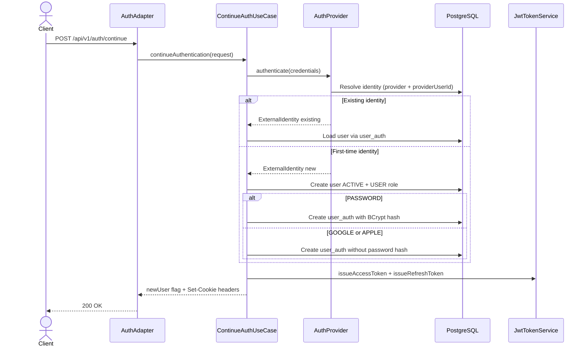
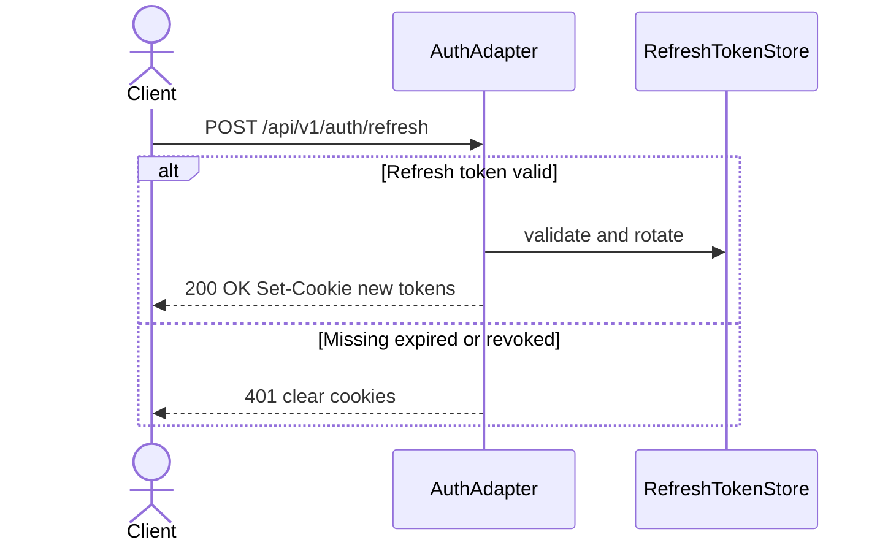
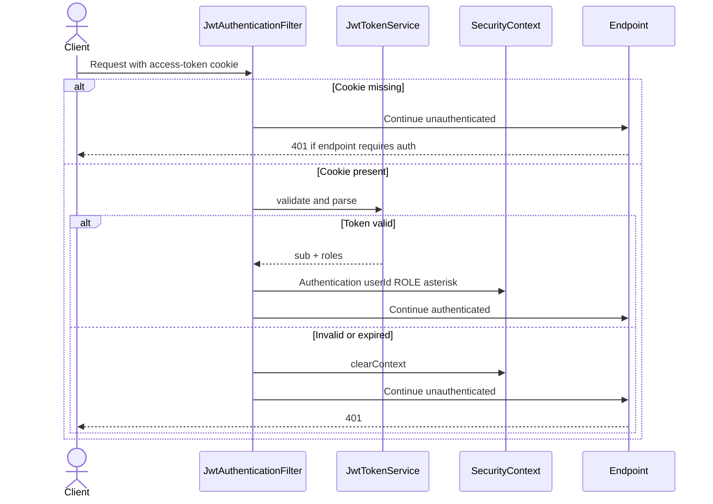
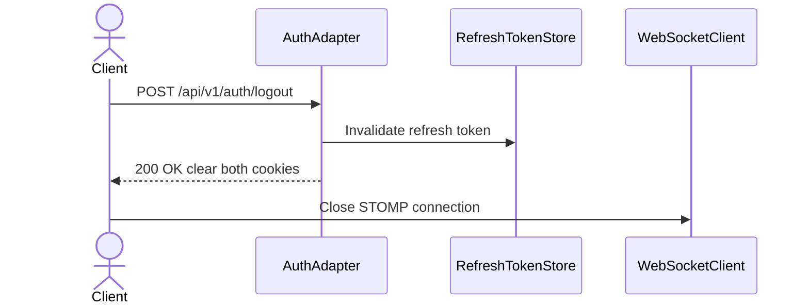

# Token and Session Management

---

## Summary

How Milly establishes and maintains a global session: auth providers, `POST /api/v1/auth/continue`, HttpOnly JWT cookies, refresh rotation, logout, and the JWT filter on protected REST calls. Overview: [security-flow.md](./security-flow.md). Endpoint classification: [public-vs-protected-endpoints.md](./public-vs-protected-endpoints.md).

---

## Table of contents

1. [Auth providers](#auth-providers)
2. [Auth continue flow](#auth-continue-flow)
3. [Cookie-based session](#cookie-based-session)
4. [Token refresh flow](#token-refresh-flow)
5. [Request authentication filter](#request-authentication-filter)
6. [Logout flow](#logout-flow)
7. [Concrete examples](#concrete-examples)
8. [Security notes](#security-notes)
9. [Environment requirements](#environment-requirements)

---

## Auth providers

`POST /api/v1/auth/continue` accepts `provider` plus provider-specific `credentials`. Unsupported providers are rejected.

| Provider | Status | Notes |
|----------|--------|-------|
| `PASSWORD` | Supported | Email + BCrypt-hashed password |
| `GOOGLE` | Supported | Google ID token validation (`GOOGLE_CLIENT_ID`) |
| `APPLE` | Optional | Apple identity token validation when configured |

---

## Auth continue flow

`POST /api/v1/auth/continue` handles both login and first-time sign-up. On success the response sets HttpOnly cookies; tokens are **not** returned in the JSON body.



---

## Cookie-based session

Tokens live in **HttpOnly** cookies (Secure in production, SameSite configured) — not in `localStorage` and not in the `Authorization` header.

| Cookie | Purpose | Typical TTL |
|--------|---------|-------------|
| `access-token` | Sent on every authenticated REST call | Short (default 900 s) |
| `refresh-token` | Used only by `POST /api/v1/auth/refresh` | Long (default 14 days) |

Signing uses HMAC with `JWT_SECRET` (`auth.jwt.secret`). Refresh tokens are also tracked server-side (Caffeine) so logout can revoke them.

Session policy: Spring `SessionCreationPolicy.STATELESS` for HTTP — access validation is JWT-based; refresh revocation is an explicit server-side store.

---

## Token refresh flow

When the access token expires, the client calls `POST /api/v1/auth/refresh` with the `refresh-token` cookie (`credentials: 'include'`).



If refresh returns **401**, the session is ended. The frontend treats the user as logged out and should close any open WebSocket connection.

---

## Request authentication filter

Every protected REST request passes through `JwtAuthenticationFilter` before the controller.



Typical messages:

- Missing cookie → `No authentication details were provided.`
- Invalid/expired access token → `JWT token is expired or invalid.`

Unauthorized responses use the shared JSON error shape (`status`, `error`, `message`, `timestamp`).

---

## Logout flow



On logout:

1. Backend revokes the server-side refresh token.
2. Backend clears `access-token` and `refresh-token` cookies (`Max-Age=0`).
3. Frontend closes any active WebSocket connection.

---

## Concrete examples

### Sign-up via continue (password)

`POST /api/v1/auth/continue`

```json
{
  "provider": "PASSWORD",
  "credentials": {
    "email": "staff@example.com",
    "password": "securepassword"
  },
  "profile": {
    "firstName": "Alex",
    "lastName": "Rivera",
    "email": "staff@example.com"
  }
}
```

```http
HTTP/1.1 200 OK
Set-Cookie: access-token=...; HttpOnly; Path=/
Set-Cookie: refresh-token=...; HttpOnly; Path=/

{"newUser": true}
```

### Login via continue (existing user)

Same endpoint; `profile` omitted. Body includes `"newUser": false` and cookies are set.

### Google

```json
{
  "provider": "GOOGLE",
  "credentials": {
    "idToken": "<google-id-token>"
  },
  "profile": {
    "firstName": "Alex",
    "lastName": "Rivera",
    "email": "staff@example.com"
  }
}
```

`profile` is required only on first sign-up.

### Refresh

`POST /api/v1/auth/refresh` — no body; browser sends `refresh-token` cookie.

---

## Security notes

- **HttpOnly cookies** reduce XSS token theft; `Secure` in production and `SameSite` reduce interception / CSRF risk.
- **CSRF**: cookie-based auth on mutating endpoints should use CSRF mitigations appropriate to the deployment (e.g. SameSite policy, double-submit cookie). Current API config disables Spring CSRF filters — treat this as a known ops concern for browser clients.
- **Password provider** stores BCrypt hashes only.
- **Google / Apple** validate identity tokens against configured client IDs / issuers.

WebSocket ticket issuance uses the authenticated session; see [web-socket-flow.md](../web-socket-flow.md).

---

## Environment requirements

| Variable | Required | Default | Purpose |
|----------|----------|---------|---------|
| `JWT_SECRET` | Yes (prod) | Dev default in local profile | HMAC signing key |
| `JWT_ACCESS_TTL_SECONDS` | No | `900` | Access token lifetime |
| `JWT_REFRESH_TTL_SECONDS` | No | `1209600` | Refresh token lifetime (14 days) |
| `AUTH_COOKIES_SECURE` | No | `false` local / `true` prod | `Secure` flag on auth cookies |
| `GOOGLE_CLIENT_ID` | For Google auth | — | Google ID token audience |
| `APPLE_CLIENT_ID` | For Apple auth | — | Apple identity token audience |
| `WS_TICKET_TTL_SECONDS` | No | `30` | Staff WebSocket ticket TTL |
