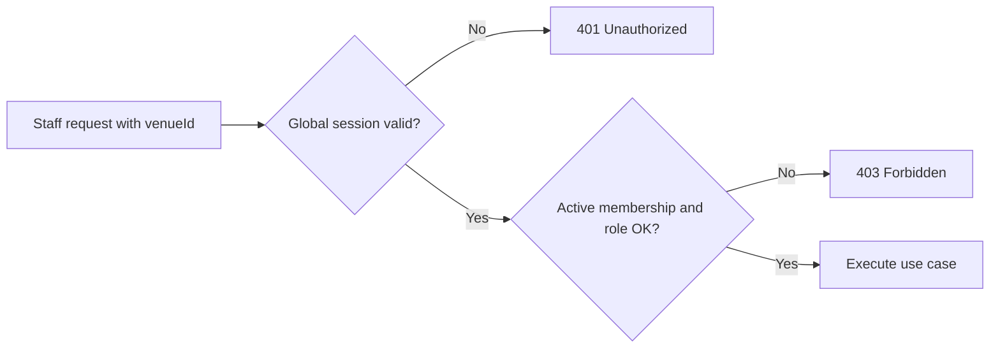

# Venue Authorization Flow

---

## Summary

After a staff request passes global authentication, Milly checks **venue membership** and **venue role** for the `venueId` in the request. Membership lives in `venue_memberships` and is resolved per request (not from the JWT). Overview: [security-flow.md](./security-flow.md). Session layer: [token-and-session-management.md](./token-and-session-management.md).

---

## Table of contents

1. [Two-step rule](#two-step-rule)
2. [Venue roles](#venue-roles)
3. [Authorization service](#authorization-service)
4. [Assignment](#assignment)
5. [Typical minimums by area](#typical-minimums-by-area)
6. [Member management rules](#member-management-rules)
7. [Examples](#examples)

---

## Two-step rule



| Step | Check | Failure |
|------|-------|---------|
| 1 | Valid global session (`access-token` cookie) | **401 Unauthorized** |
| 2 | Active membership with role sufficient for the use case | **403 Forbidden** (or inactive-membership error) |

The frontend may hide UI by venue role; the **backend always enforces** these checks in use cases via `VenueAuthorizationService`.

---

## Venue roles

| Role | Rank | Notes |
|------|------|-------|
| `OWNER` | 3 | Highest; created when a user registers a venue |
| `MANAGER` | 2 | Can manage menu, tables, invitations, members (within rules), orders |
| `EMPLOYEE` | 1 | Active member; sufficient for order operations |

`isAtLeast(required)` compares ranks. Venue roles are **not** embedded in the JWT — changes apply on the next request without token re-issue.

---

## Authorization service

`VenueAuthorizationService` exposes the checks used by staff use cases:

| Method | Meaning |
|--------|---------|
| `requireMember` | Membership row exists for `userId` + `venueId` |
| `requireActiveMember` | Membership exists and status is `ACTIVE` |
| `requireAtLeastRole` | Active membership and role rank ≥ required |
| `requireCanManageMember` | Actor may change/disable the target member |
| `requireCanAssignRole` | Actor may set a new non-`OWNER` role on the target |

Inactive membership fails even if a row exists.

---

## Assignment

| Event | Role granted |
|-------|--------------|
| User creates a venue | `OWNER` on that venue |
| User redeems an invitation | Role encoded on the invitation (`MANAGER` or `EMPLOYEE`; never `OWNER` via invite) |

Invitations are created by callers with at least `MANAGER`. Creating an invitation for `OWNER` is rejected.

---

## Typical minimums by area

Exact checks live in each use case; this table reflects current backend behavior:

| Area | Typical check |
|------|---------------|
| Staff orders (list, get, approve, reject, close, estimate) | `requireActiveMember` (any active role) |
| Menu CRUD | `requireAtLeastRole(..., MANAGER)` |
| Tables CRUD / QR / activate / deactivate | `requireAtLeastRole(..., MANAGER)` |
| Create invitation / list or update members | `requireAtLeastRole(..., MANAGER)` (+ member-management rules) |

---

## Member management rules

When updating another member:

- Actor cannot manage themselves.
- Target `OWNER` cannot be managed.
- `OWNER` may manage others (non-owner targets).
- `MANAGER` may manage `EMPLOYEE` only.
- New role cannot be `OWNER`.

---

## Examples

### Active member order access

```http
GET /api/v1/venues/{venueId}/orders
Cookie: access-token=<jwt>
```

| Outcome | Response |
|---------|----------|
| No / invalid cookie | `401 Unauthorized` |
| Valid session, no / inactive membership | `403` (or inactive membership error) |
| Valid session, active `EMPLOYEE` / `MANAGER` / `OWNER` | `200 OK` |

### Manager-only menu create as employee

```http
POST /api/v1/venues/{venueId}/menu/items
Cookie: access-token=<jwt>
```

| Outcome | Response |
|---------|----------|
| Active `EMPLOYEE` | `403 Forbidden` |
| Active `MANAGER` or `OWNER` | Success (e.g. `201 Created`) |
