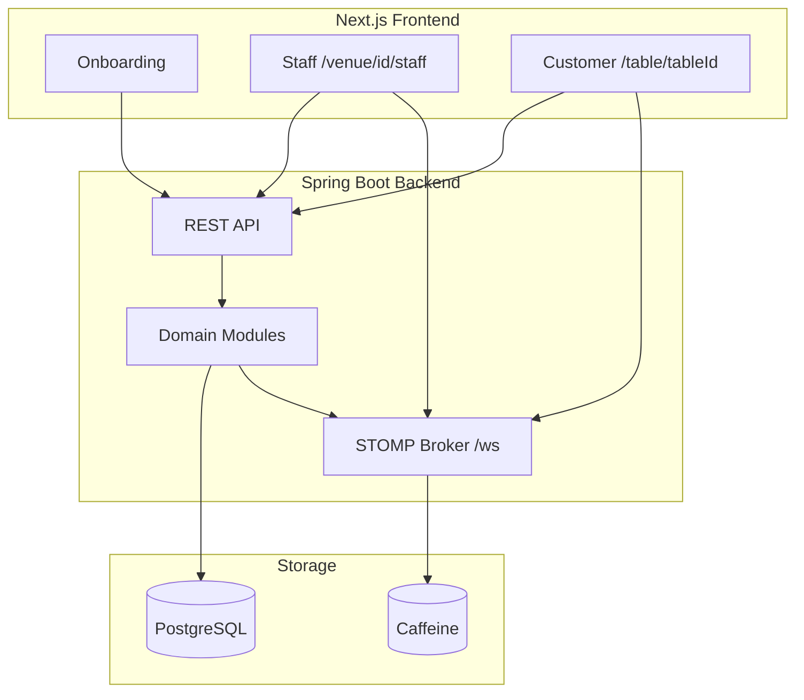
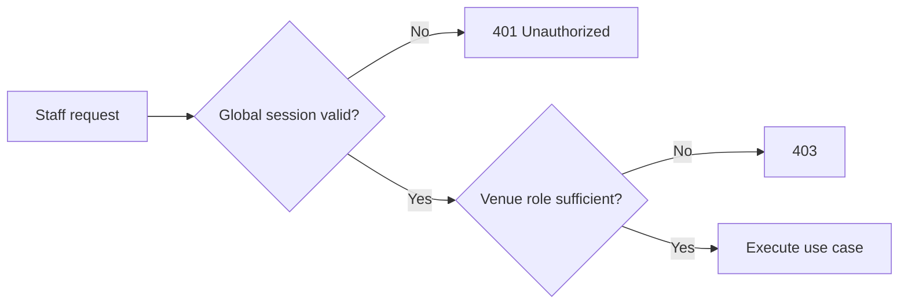

# System Design

**Author:** Omar Ismayilov

---

## Summary

High-level overview of the Milly restaurant ordering platform: multi-venue identity, how **staff** and **customer** apps talk to the backend, where data is stored, and how modules are organized on both sides. Users authenticate **globally** (system level); access to a venue's operations is granted via **venue roles**. REST (`/api/v1`) handles reads and writes; STOMP over WebSocket pushes real-time events after mutations. PostgreSQL is the system of record; Caffeine holds ephemeral handshake data (WebSocket tickets, invitation redemption).

For WebSocket details see [web-socket-flow.md](./web-socket-flow.md). For login, OAuth, venue membership, and authorization see [security-flow.md](./security-flow.md).

---

## Table of contents

1. [System context](#system-context)
2. [Identity model](#identity-model)
3. [Pages and routes](#pages-and-routes)
4. [Communication model](#communication-model)
5. [Persistence](#persistence)
6. [Backend modules](#backend-modules)
7. [Frontend modules](#frontend-modules)
8. [Client flows](#client-flows)

---

## System context

Milly is a **multi-venue** restaurant platform. A user account exists independently of any venue. To operate a restaurant, the user either **registers a new venue** (becomes Manager) or **joins an existing venue** via an invitation. Customers at a table remain anonymous — no account required.

| Journey | Route | Auth | Purpose |
|---------|-------|------|---------|
| **Onboarding** | `/`, `/login`, `/register-venue`, `/join-venue` | Global user session | Sign up, create or join a venue |
| **Staff portal** | `/venue/{venueId}/staff` | Global session + venue role | Orders, menu, tables, QR (by role) |
| **Customer** | `/table/{tableId}` | None | Browse menu, order, pay |

One **Next.js** frontend and one **Spring Boot** backend serve all journeys.

---

## Identity model

Milly separates **system identity** from **venue access**.

### System level

| Concept | Description |
|---------|-------------|
| **User** | Global account — created on sign-up / OAuth |
| **System role** | `USER` — every authenticated account has this role by default |
| **Session** | JWT in HttpOnly cookies; proves who the user is, not which venue they operate |

Sign-in methods (planned): email/password, Google OAuth2, Apple (optional).

### Venue level

| Concept | Description |
|---------|-------------|
| **Venue** | A restaurant (name, location, …) — tenant boundary for menu, tables, orders |
| **Venue membership** | Link between a user and a venue |
| **Venue role** | What the user can do **inside that venue** |

| Venue role | Access |
|------------|--------|
| **Manager** | Orders, menu, tables, QR codes, invitations, venue settings |
| **Waiter** | Orders only (view, approve, reject, close) |

A user can belong to **multiple venues** with different roles at each.

### Authorization rule

Every staff request is checked in two steps:

1. **Authenticated?** — valid global session (cookie).
2. **Authorized for this venue?** — user has a venue membership with the required role.

If step 2 fails → **403 Forbidden**. The frontend may hide UI by role, but the **backend always enforces** permissions. The frontend can validate the current user's venue role via a backend call (e.g. proxy / session endpoint) — never trust client-side role state alone.

---

## Pages and routes

### Home and authentication

| Route | Purpose |
|-------|---------|
| `/` | Welcome screen — **Join Venue** and **Register Venue** |
| `/login` | Sign in / sign up (email, Google, Apple). Both home buttons lead here; intended post-login destination is remembered |

After login, the user is redirected based on which home action they chose:

- **Register Venue** → `/register-venue`
- **Join Venue** → `/join-venue`

### Register venue

| Route | Purpose |
|-------|---------|
| `/register-venue` | Form: venue name, location, and other basic fields → **Create** |

On create, the backend creates the venue and assigns the user **Manager** at that venue. User is redirected to `/venue/{venueId}/staff`.

### Join venue

| Route | Purpose |
|-------|---------|
| `/join-venue` | **My venues** — list of venues the user belongs to, with role shown per row |
| `/join-venue` (action) | **Join new venue** — paste invitation link or code → **Confirm** |

