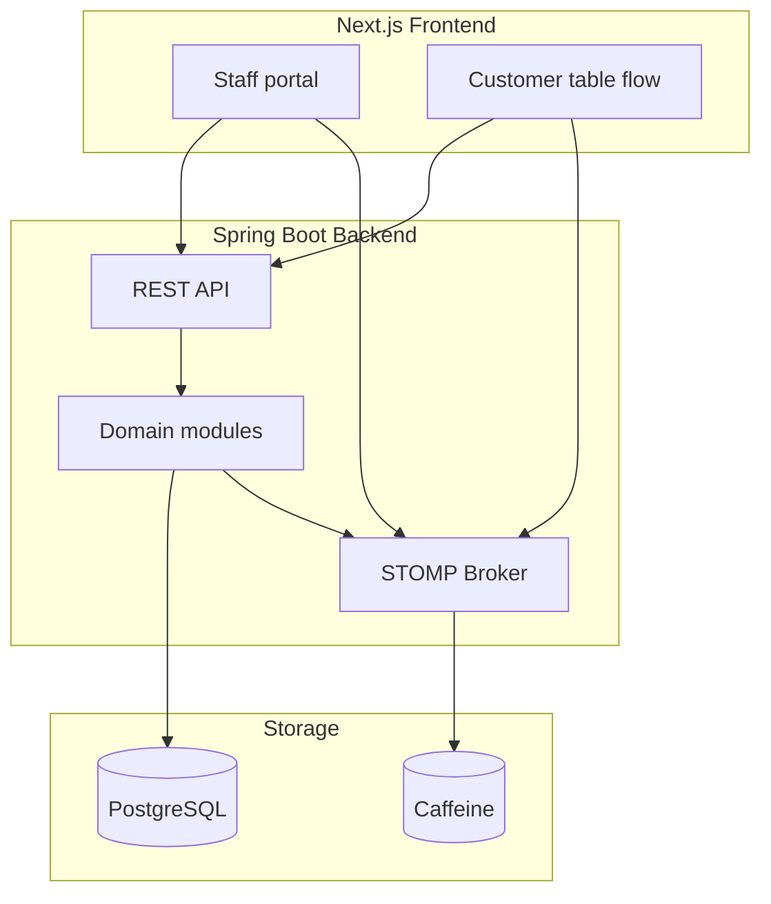

# System Design

---

## Summary

Milly is a **multi-venue** restaurant ordering platform. One **Spring Boot** backend and one **Next.js** frontend serve staff (venue operations) and customers (table ordering). Clients load and mutate data over REST (`/api/v1`); the backend pushes real-time updates over STOMP/WebSocket. PostgreSQL is the system of record; Caffeine holds short-lived ephemeral state.

Deeper topics live in the [related documentation](#related-documentation).

---

## Table of contents

1. [System context](#system-context)
2. [High-level architecture](#high-level-architecture)
3. [Persistence](#persistence)
4. [Modules](#modules)
5. [Related documentation](#related-documentation)

---

## System context

Users have a **global** account. Operating a restaurant requires **venue access** (create a venue or join one). Customers at a table order without an account.

| Client | Who | Purpose |
|--------|-----|---------|
| **Staff** | Authenticated users with venue access | Orders, menu, tables, and venue management |
| **Customer** | Anonymous table guests | Browse menu, place orders, pay; table chat |

---

## High-level architecture

Staff and customer UIs talk to the same backend. REST is the source of truth for reads and writes; WebSocket notifies subscribed clients after mutations (and carries table chat).



---

## Persistence

| Store | Technology | Purpose |
|-------|------------|---------|
| **Primary database** | PostgreSQL | Users, venues, memberships, menu, tables, orders, payments, invitations |
| **Ephemeral cache** | Caffeine | Short-lived state: WebSocket tickets, refresh tokens, venue invitations, idempotency records |

---

## Modules

Feature code is organized under `com.milly` by bounded context. Module names are **singular**.

```
com.milly/
├── config/      # Cross-cutting wiring (security, WebSocket, Jackson, cache, AI client)
├── common/      # Shared kernel (IDs, money, errors, idempotency)
├── auth/        # Global identity, login, sessions, admin users
├── venue/       # Venues, memberships, invitations
├── table/       # Tables within a venue
├── menu/        # Menu catalog per venue
├── order/       # Order lifecycle per venue
├── billing/     # Payments per venue
└── chatbot/     # Table chat assistant over WebSocket
```

| Module | Owns |
|--------|------|
| **config** | Global infrastructure configuration (including AI chat port) |
| **common** | Shared value objects, domain exceptions, idempotency support |
| **auth** | Sign-up / sign-in, JWT sessions, WebSocket ticket issuance, admin user APIs |
| **venue** | Venue CRUD, memberships, roles, invitations |
| **table** | Tables and QR entry points within a venue |
| **menu** | Menu catalog scoped to a venue |
| **order** | Order lifecycle and related real-time events |
| **billing** | Payments and related real-time events |
| **chatbot** | Customer table chat via STOMP; replies use menu context and the AI client |

Venue-bound modules scope data and operations by venue. Details of authentication, WebSocket, AI, and payments are in the docs below.

---

## Related documentation

| Document | Covers |
|----------|--------|
| [installation.md](./installation.md) | Docker Compose, local Gradle run |
| [environment-setup.md](./environment-setup.md) | Environment variables and profiles |
| [development-instructions.md](./development-instructions.md) | Day-to-day dev workflow, layout, tests, git |
| [api-documentation.md](./api-documentation.md) | Bruno collection + Swagger / OpenAPI |
| [security/security-flow.md](./security/security-flow.md) | Security model overview; links to security subdocs |
| [security/public-vs-protected-endpoints.md](./security/public-vs-protected-endpoints.md) | Public vs authenticated vs admin routes |
| [security/token-and-session-management.md](./security/token-and-session-management.md) | Auth providers, cookies, refresh, logout |
| [security/venue-authorization-flow.md](./security/venue-authorization-flow.md) | Venue membership and role checks |
| [web-socket-flow.md](./web-socket-flow.md) | STOMP connections, tickets, subscription guards |
| [ai/ai-integration.md](./ai/ai-integration.md) | AI ports, OpenRouter/LangChain4j, enablement |
| [ai/chatbot.md](./ai/chatbot.md) | Table chat WebSocket + AI message flow |
| [billing-flow.md](./billing-flow.md) | Payment model, validation, billing API flow |
