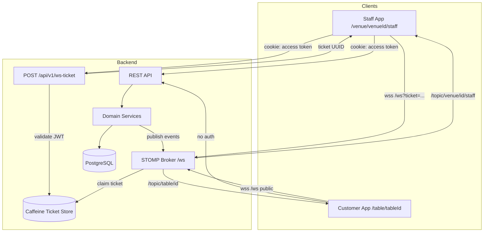
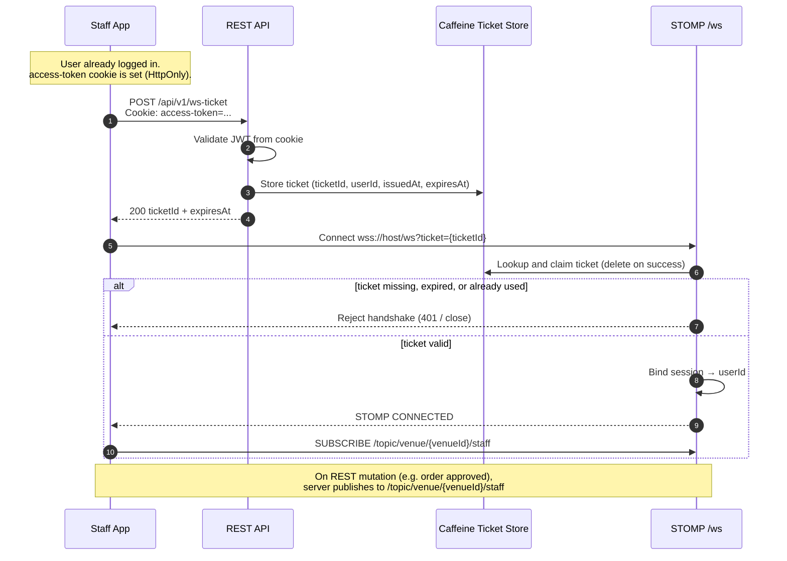
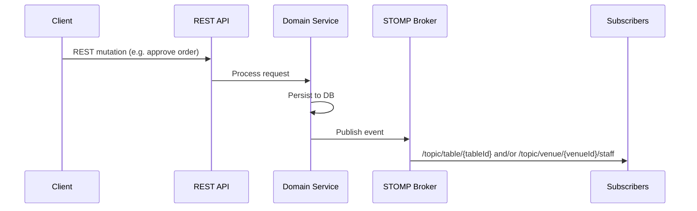
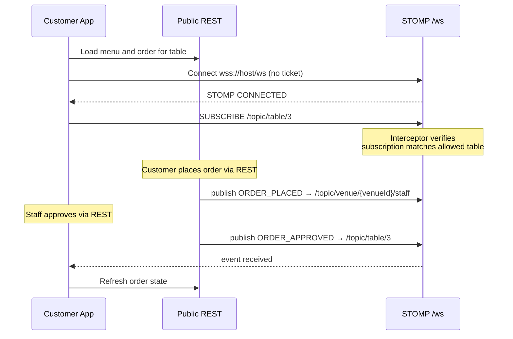

# WebSocket Connection & Security Flow

**Author:** Omar Ismayilov

---

## Summary

Describes how Milly secures STOMP over WebSocket: staff authenticate via a **single-use ticket** exchanged from a cookie-based JWT; customers connect **anonymously** with table-scoped subscriptions. Staff topics are **venue-scoped** (`/topic/venue/{venueId}/staff`). Covers ticket storage in Caffeine, handshake rules, subscription guards, and failure handling. Global login and venue authorization are described in [security-flow.md](./security-flow.md). Part of the broader system in [system-design.md](./system-design.md).

---

## Table of contents

1. [Architecture overview](#architecture-overview)
2. [Connection modes](#connection-modes)
3. [Staff flow — ticket exchange](#staff-flow--ticket-exchange)
4. [Subscription guard](#subscription-guard)
5. [Public customer behaviour](#public-customer-behaviour)
6. [Security notes](#security-notes)
7. [Failure modes](#failure-modes)

---

## Architecture overview

Milly uses **STOMP over WebSocket** for real-time order and payment notifications. HTTP (REST) remains the source of truth for reads and writes; WebSocket is a **push channel** only.

---

## Connection modes

| Mode | Page | REST | WebSocket handshake | Subscriptions allowed |
|------|------|------|---------------------|------------------------|
| **Public** | `/table/{tableId}` | Public endpoints (menu, orders for table, payments) | Anonymous — no ticket | `/topic/table/{tableId}` only |
| **Authenticated** | `/venue/{venueId}/staff` | Protected endpoints (JWT cookie + venue role) | Ticket required | `/topic/venue/{venueId}/staff` |

Both modes connect to the same STOMP endpoint: `wss://{host}/ws`

Staff append the ticket: `wss://{host}/ws?ticket={uuid}`

---

## Staff flow — ticket exchange

Staff must never put the long-lived JWT in the WebSocket URL. Cookies are not reliably sent on cross-origin WebSocket upgrades, so we use a **short-lived, single-use ticket** bound to the authenticated user.

### Ticket store

Tickets live in an in-process **Caffeine** cache with a **30 second TTL**:

| Field | Description |
|-------|-------------|
| `ticketId` | Random UUID sent to the client once |
| `userId` | Staff user this ticket belongs to |
| `issuedAt` | When the ticket was created |
| `expiresAt` | When the ticket expires (issuedAt + 30s) |

A ticket is **single-use** — deleted the moment it is claimed during handshake. On reconnect, the client must call `POST /api/v1/ws-ticket` again for a fresh ticket.

Caffeine is sufficient for single-instance deployments. Use a shared store (e.g. Redis) when running multiple backend replicas.

---

## Subscription guard

Enforce authorization at `SUBSCRIBE` time, not only at handshake:

| Session type | Allowed subscriptions |
|--------------|----------------------|
| Anonymous (customer) | `/topic/table/{tableId}` — only the table the client is viewing |
| Authenticated staff | `/topic/venue/{venueId}/staff` — only the venue the staff member is operating |

Any other subscription attempt is rejected.

### Publish flow (server-side only)

Clients do not send business commands over WebSocket. The server publishes events after successful REST operations.

---

## Public customer behaviour

The customer journey at `/table/{tableId}` is fully **unauthenticated**.

**Key points:**

- No `POST /api/v1/ws-ticket` for customers.
- Connection is anonymous; security relies on **topic-scoped subscriptions** and **table-scoped REST** writes.
- The customer app uses `tableId` from the route so the subscription guard only allows `/topic/table/{tableId}`.
- Knowing a `tableId` is intentional (QR code). Other tables' data must not be exposed via REST or WebSocket.

---

## Security notes

1. **JWT never in the URL.** Only the ephemeral ticket appears in the WebSocket query string. Tickets are useless after claim or 30s expiry.
2. **HttpOnly cookies** for access tokens protect against XSS reading the JWT. The ticket endpoint reads the cookie server-side.
3. **Single-use tickets** prevent replay if the URL is logged or leaked during the brief handshake window.
4. **Short TTL (30s)** limits exposure if a ticket is issued but never used.
5. **Subscription interceptor** is mandatory. Handshake alone is not enough — block staff topics on anonymous sessions, block cross-venue topics on staff, and block cross-table topics on customers.
6. **CORS / origins** — restrict allowed origins in production to known front-end domains.
7. **WSS in production** — always `wss://` behind TLS.
8. **Multi-instance** — Caffeine is per JVM; use Redis (or similar) for a shared ticket store when horizontally scaling.
9. **Rate limit** `POST /api/v1/ws-ticket` to prevent ticket flooding.

---

## Failure modes

| Scenario | Expected behaviour |
|----------|-------------------|
| Ticket expired (>30s) | Handshake rejected; client requests new ticket |
| Ticket already used | Handshake rejected; client requests new ticket |
| No ticket on staff page | Handshake rejected; client fetches ticket first |
| WS drops mid-session | Reconnect: obtain a **new** ticket via `POST /api/v1/ws-ticket`, then reconnect — do not reuse old tickets |
| Invalid / forged ticket | Handshake rejected |
| Customer subscribes to `/topic/venue/{venueId}/staff` | Subscription denied |
| Customer subscribes to wrong table topic | Subscription denied |
| Access-token cookie expired | `POST /api/v1/ws-ticket` returns 401; client ends session and returns to `/` |
